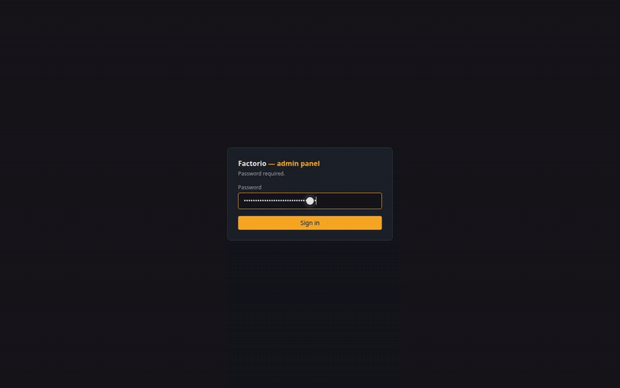
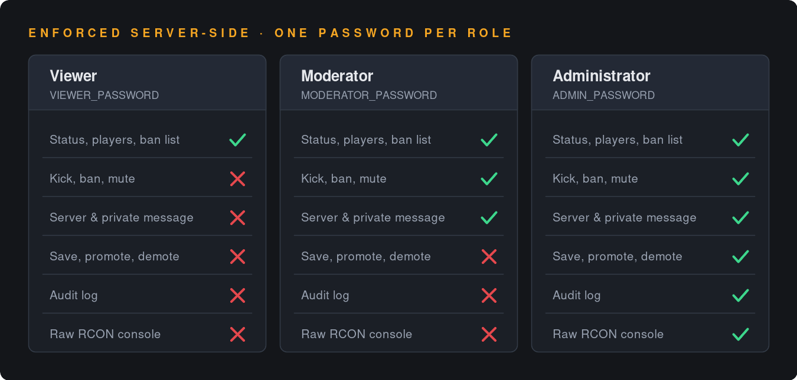

# Factorio Admin RCON

**Not a server manager: a hardened RCON admin console.** Give moderators the server actions they
need without handing them full RCON.

[](LICENSE)
[](https://hub.docker.com/r/williamnauroy/factorio-admin-rcon)
[](https://hub.docker.com/r/williamnauroy/factorio-admin-rcon/tags)
[](https://hub.docker.com/r/williamnauroy/factorio-admin-rcon/tags)
[](#hardened-image-optional)
[](https://github.com/EdwinAlkins/factorio-admin-rcon/actions/workflows/release.yml)



**[Documentation](https://edwinalkins.github.io/factorio-admin-rcon/)** ·
[Quick start](#quick-start-without-cloning) ·
[Docker Hub](https://hub.docker.com/r/williamnauroy/factorio-admin-rcon) ·
[Security model](#security-model) · [FAQ](#faq)

- **Three roles**, enforced server-side — the catalogue is filtered *and* execution re-checks;
- **bounded actions**: the server builds the command from validated fields, so a moderator gets a
  "Kick" button without getting arbitrary Lua;
- **audit log** of every action, refusals included;
- **raw RCON console**, restricted to the administrator;
- **Docker**, `amd64` and `arm64`, with a distroless variant, SBOM and provenance;
- **English and French**, inferred from the browser.

## What it is, and what it is not

Raw RCON is an all-or-nothing door: one password, no rate limiting, no trace, and full control of
the server for whoever gets through it. This panel puts roles, bounded commands and an audit log in
front of that door. It does **not** manage the server process.

| Need | This panel | Where to look instead |
| --- | --- | --- |
| Kick, ban, mute, message players from a browser | ✅ | — |
| Delegate moderation without handing out RCON | ✅ | — |
| Know who ran what, and what was refused | ✅ | — |
| Run your own Lua one-liners as bounded buttons | ✅ | [Custom commands](#custom-commands) |
| Install, enable or update **mods** | ❌ | [factoriotools/factorio](https://github.com/factoriotools/factorio-docker) and its env vars |
| Upload, download or roll back **saves** | ❌ | The `./data` volume |
| Start, stop or update the **server binary** | ❌ | Your compose file, or [OpenFactorioServerManager](https://github.com/OpenFactorioServerManager/factorio-server-manager) |
| Drive the server **from scripts** rather than a browser | ❌ | [nekomeowww/factorio-rcon-api](https://github.com/nekomeowww/factorio-rcon-api) |

The honest comparison: *Factorio Server Manager* drives the binary and covers mods and saves, but
it has had no release since March 2021 and has never seen Factorio 2.0. It solves a different
problem, and where the two overlap this panel is the narrower, harder-edged tool.

## Compatibility

| | Supported |
| --- | --- |
| Factorio | 2.x, Space Age included |
| Server image | [`factoriotools/factorio`](https://hub.docker.com/r/factoriotools/factorio), or any image exposing standard RCON |
| Architectures | `linux/amd64`, `linux/arm64` |
| Runtime | Docker with the Compose v2 plugin; or Node 24+ from source |
| Browsers | Current Firefox, Chrome and Safari |

Not supported: Factorio **before 2.0**, non-standard RCON implementations, and running **more than
one instance** of the panel against the same server — rate limiters and the status cache live in
process memory, so a second instance would make both bypassable (see [Security
model](#security-model)).

## Quick start (without cloning)

Nothing to clone: one directory, a `docker-compose.yml` pasted as-is, a `.env` you generate. The
panel is published on Docker Hub, so `docker compose up` is the whole install.

```yaml
# docker-compose.yml
services:
  factorio:
    container_name: factorio-server
    image: factoriotools/factorio:stable
    restart: unless-stopped
    ports:
      # Game port only. RCON stays unpublished: the panel reaches it over the
      # compose network, and the port hands full server control to whoever
      # holds the password.
      - "34197:34197/udp"
    volumes:
      - ./data:/factorio
    environment:
      - UPDATE_MODS_ON_START=true

  factorio-admin:
    container_name: factorio-admin-panel
    # A minor tag: patches arrive, a major never lands on you by surprise.
    # `latest` moves under you on the next release; in production, pin the exact
    # version instead. `-distroless` is the hardened variant (no shell, no
    # package manager) — the full tag list is on Docker Hub.
    image: williamnauroy/factorio-admin-rcon:1.3-distroless
    restart: unless-stopped
    depends_on:
      - factorio
    ports:
      # Loopback only: the panel grants full RCON access. Both stacks, so a
      # browser resolving "localhost" to ::1 also reaches it.
      - "127.0.0.1:3010:3000"
      - "[::1]:3010:3000"
    volumes:
      # The directory, not the file: a regenerated rconpw is picked up as is.
      - ./data/config:/factorio-config:ro
      # Sessions, audit log and metric series (SQLite).
      - factorio-admin-data:/data
    read_only: true
    tmpfs:
      - /tmp:rw,noexec,nosuid,size=16m
    cap_drop:
      - ALL
    security_opt:
      - no-new-privileges:true
    mem_limit: 256m
    pids_limit: 128
    environment:
      - RCON_HOST=factorio
      - RCON_PORT=27015
      - RCON_PASSWORD_FILE=/factorio-config/rconpw
      - ADMIN_PASSWORD=${ADMIN_PASSWORD:?set it in .env}
      - SESSION_SECRET=${SESSION_SECRET:?set it in .env, 32 chars minimum}
      # This stack has no docker-socket-proxy, so the CPU and memory graphs are
      # off. Players and UPS keep working. Add the service from the repository's
      # compose file to get them back.
      - METRICS_DOCKER=false

volumes:
  factorio-admin-data:
```

Secrets are generated rather than typed — `setup-admin.sh` does this in the repository, and these
two lines are what it comes down to:

```bash
cat > .env <<EOF
ADMIN_PASSWORD=$(openssl rand -base64 18)
SESSION_SECRET=$(openssl rand -hex 32)
EOF

docker compose up -d
cat .env            # the password to log in with
                    # → http://127.0.0.1:3010
```

`MODERATOR_PASSWORD` and `VIEWER_PASSWORD` are optional: add them to `.env` and to the service's
`environment:` to open the two read-only roles. A role without a password simply has no account.

On the very first start the game server is still creating its map, and `data/config/rconpw` does not
exist yet — the panel reports RCON as unavailable for a few seconds. It reads the file again on
every connection attempt, so it recovers on its own, without a restart.

Updating is a pull, since nothing is built locally:

```bash
# after bumping the tag in docker-compose.yml
docker compose pull && docker compose up -d
```

## Development

```bash
cp .env.example .env.local   # set ADMIN_PASSWORD at minimum
npm install
npm run dev                  # http://localhost:3000
```

The Factorio server must be running (`docker compose up -d factorio`). RCON is **not published by
default** — in production the panel reaches it over the compose network, so nothing needs to be
exposed on the host. To develop against it, uncomment the loopback mapping in `docker-compose.yml`:

```yaml
- "127.0.0.1:27015:27015/tcp"
```

The RCON password is read from `./data/config/rconpw`, which the `factoriotools/factorio` image
generates on its first start.

```bash
npm run lint        # eslint
npm run typecheck   # next typegen && tsc --noEmit (TypeScript 7, see CI.md)
npm test            # vitest
npm run build
```

Tests come in three layers:

| Path | Covers |
| --- | --- |
| `tests/<domain>/` | pure logic: RCON queue and lifecycle, Lua escaping, catalogue validation, sessions, rate limiters, metrics, dictionaries |
| `tests/api/` | the route handlers, called with a real `Request`: auth, roles, validation, error codes, audit trail |
| `tests/security/` | what must not regress: origin checking on every mutating route, `X-Forwarded-For` only trusted behind `TRUST_PROXY`, cookie flags, CSP nonce |

## Dependencies

[Dependabot](https://docs.github.com/code-security/dependabot) keeps npm packages, Docker base
images and GitHub Actions up to date; `.github/dependabot.yml` holds the policy. Nothing to install
— the file is enough.

The choice that matters is the commit prefix, because semantic-release reads it:

| Source | Commit | Effect |
| --- | --- | --- |
| `dependencies` | `fix(deps): …` | Cuts a version and rebuilds the image — a security fix has to reach deployments |
| `devDependencies` | `chore(deps-dev): …` | No release |
| Docker, GitHub Actions | `chore(deps): …` | No release |

Updates are grouped so you do not get one PR per package: `next` + `react` together (a major of one
forces the major of the other), then `eslint`, `vitest`, `tailwindcss`, and the rest of the tooling
in a single PR.

The Node version lives in four places. Dependabot follows the `Dockerfile`s; `engines` in
`package.json` and `node-version` in `.github/workflows/ci.yml` must be aligned by hand in the same
PR.

> **Security updates are a separate switch.** This file only governs version updates. Vulnerability
> fixes depend on Dependabot alerts, enabled under *Settings → Advanced Security* — currently off on
> this repository.

## Production

The `factorio-admin` service in the root `docker-compose.yml`:

```bash
./setup-admin.sh                              # generates ./.env (passwords + session key)
docker compose up -d --build factorio-admin   # http://127.0.0.1:3010
```

`setup-admin.sh --all` also creates the moderator and viewer passwords, `--ask` prompts for them
instead of generating them, and `--force` rotates every secret (which ends open sessions). Values
already present in `.env` are kept by default.

An image is published on every release to `williamnauroy/factorio-admin-rcon` (`linux/amd64` and
`linux/arm64`). Pin an exact version in production:

```bash
# Replace <version> with the exact release you are deploying — the published
# tags are listed on Docker Hub. Every release also publishes the floating
# minor, major and `latest` tags.
docker pull williamnauroy/factorio-admin-rcon:<version>
docker pull williamnauroy/factorio-admin-rcon:<version>-distroless   # hardened, see below
```

Versioning and publishing are automated — see [CI.md](CI.md).

### Hardened image (optional)

`Dockerfile.distroless` builds the same application on `gcr.io/distroless/nodejs24-debian13`, which
ships Node and nothing else — `/bin`, `/usr/bin` and `/sbin` are empty. The default `Dockerfile` is
unchanged; this one is opt-in, either by pulling its published tag or by building it:

```bash
docker pull williamnauroy/factorio-admin-rcon:<version>-distroless
# or, from source
docker build -f Dockerfile.distroless -t factorio-admin-rcon:distroless .
```

To build it through compose instead, swap `dockerfile:` under `factorio-admin` — the alternative is
spelled out in a comment there.

Gone from the image: `sh`, `nc`, `wget`, `vi`, `cat`, `apk`, `npm`. The most valuable of those is
the shell — `child_process.exec()` spawns `/bin/sh -c`, so without it command injection has nothing
to run, and most off-the-shelf reverse shells stop working. Nothing legitimate depends on a shell
here: the codebase never uses `child_process`.

Be clear about the limit, though: **`node` is still the most capable binary in the image**. Anyone
able to execute JavaScript in the container can read files and open sockets through `fs` and `net`.
This raises the cost of post-exploitation, it does not remove it.

Both images run as uid 1000 and are volume-compatible, so switching either way keeps an existing
`factorio-admin-data` database. (That is why the distroless stage sets `USER 1000:1000` explicitly
instead of the base image's own `nonroot` user at 65532, which could not write to it.)

The trade-off is troubleshooting: there is no `docker exec … sh`. Attach a throwaway toolbox
sharing the container's namespaces instead:

```bash
docker run --rm -it \
  --pid=container:factorio-admin-panel \
  --network=container:factorio-admin-panel \
  nicolaka/netshoot
```

## Roles

One password per role; the role is determined by the password used to sign in.



| Role | Variable | Can do |
| --- | --- | --- |
| `viewer` | `VIEWER_PASSWORD` | Status, players, version, seed, evolution, admins, ban list |
| `moderator` | `MODERATOR_PASSWORD` | + kick, ban/unban, mute/unmute, server message, private message |
| `admin` | `ADMIN_PASSWORD` | + save, promote/demote, custom commands, **raw RCON console**, audit log |

Permissions are enforced **server-side**: the action catalogue is filtered by role, and
`/api/actions` re-checks the permission before executing anything.

### Authentication model

There is **one password per role**, not individual user accounts: five moderators share
`MODERATOR_PASSWORD`, and the audit log records the role rather than the person. This is a
deliberate fit for a small self-hosted server, not an unfinished feature — it keeps the deployment
to a handful of environment variables, with no user database to administer.

What it costs you: you cannot revoke one moderator without rotating the shared password, and the
audit trail attributes actions to a role. If you need per-person accountability today, put an
authenticating reverse proxy in front of the panel. Individual accounts are on the
[roadmap](#roadmap).

## Custom commands

The built-in catalogue covers moderation; everything else — the Lua one-liners every server ends up
keeping in a text file — goes in a JSON catalogue **you** provide. Point `CUSTOM_COMMANDS_FILE` at
it (default `/factorio-config/commands.json`, already mounted read-only by `docker-compose.yml`, so
dropping the file in `./data/config/` is enough). A ready-made catalogue lives in
[`examples/commands.json`](examples/commands.json).

The point is not just convenience: a command declared here is **bounded**. A moderator gets a
"Kill all enemies" button with a player field, without ever getting `rcon:raw` — that is, without
being able to run arbitrary Lua.

```json
{
  "version": 1,
  "groups": { "cleanup": { "en": "Cleanup", "fr": "Nettoyage" } },
  "commands": [
    {
      "id": "kill-enemies",
      "group": "cleanup",
      "permission": "action:moderate",
      "label": { "en": "Kill all enemies", "fr": "Tuer tous les ennemis" },
      "hint": { "en": "Every enemy entity on the player's surface" },
      "params": [{ "name": "player", "type": "player", "label": { "en": "Player" } }],
      "template": "/c for _, e in pairs(game.players[{{player}}].surface.find_entities_filtered({force = \"enemy\"})) do e.destroy() end"
    }
  ]
}
```

| Key | Default | Meaning |
| --- | --- | --- |
| `id` | — | Unique; exposed and audited as `custom:<id>` |
| `group` | `custom` | Heading in the quick actions; label taken from `groups` |
| `permission` | `action:custom` | `action:info`, `action:moderate`, `action:server` or `action:custom` |
| `risk` | `dangerous` | `dangerous` colours the button as destructive |
| `confirm` | `true` | Ask for confirmation before running |
| `preview` | `true` | Show the exact command in that confirmation |
| `label` / `hint` / `confirmation` | — | `"text"` or `{ "en": …, "fr": … }`; `label` is required |
| `params` | `[]` | Fields the user fills in |
| `template` | — | The command, with `{{name}}` markers |

| `type` | Accepts | Inserted as |
| --- | --- | --- |
| `player` | no spaces, quotes or backslash, 60 max | Lua string |
| `text` | no line breaks, `maxLength` (200 by default) | Lua string |
| `identifier` | prototype name (`iron-plate`) | Lua string |
| `int` / `float` | a number within `min`/`max` | bare number |
| `bool` | a checkbox | `true` / `false` |
| `enum` | one value out of `options` | Lua string (bare with `"raw": true`) |

Params also take `required` (default `true`), `default`, `label`, `placeholder` and `help`. A
non-textual optional param **must** declare a `default` — otherwise an empty field has no meaning.

Two things to know before writing templates:

- **the template never writes the quotes** — `game.players[{{player}}]`, not
  `game.players["{{player}}"]`. The panel builds the whole Lua literal, quotes included, and
  escapes what the user typed. This is what makes the delegation safe: a value cannot break out of
  the string it lands in. Use `{{arg:name}}` to insert a value bare, for regular commands
  (`/kick {{arg:player}} {{arg:reason}}`);
- **`--` is refused in a template.** Line breaks are flattened into spaces before sending, so a Lua
  comment would swallow the rest of the command.

And two Factorio facts that trip up copy-pasting from the [wiki](https://wiki.factorio.com/console):

- **`game.player` is `nil` over RCON** — there is no current player. Use `game.players["Name"]`,
  `game.surfaces["nauvis"]`, `game.forces["player"]`, and `rcon.print(…)` instead of
  `game.player.print(…)` if you want to see the output in the panel;
- **`/c` permanently disables achievements** for the save.

The file is re-read whenever it changes, so you can fix your catalogue without restarting the
container. It is deliberately forgiving: a malformed entry is skipped with a log line naming it,
and an unparseable file leaves the panel running with the built-in actions only (`/api/ready`
reports `commands: false`).

## Languages

The panel ships in English (default) and French. The language is inferred from the
`Accept-Language` header on first visit, can be changed from the switcher in the status bar, and is
remembered in a cookie. It shows up in the URL: `/` for English, `/fr` for French.

To add a language:

1. copy `messages/en.json` to `messages/<code>.json` and translate the values;
2. add the code to `locales` in `src/i18n/routing.ts`;
3. add its name under `localeSwitcher` in every dictionary;
4. `npm test` — the suite checks that all dictionaries expose exactly the same keys, that no
   catalogue action is missing a label, and that every message compiles as ICU.

No interface text lives in `src/server/`: the API returns identifiers only (`ban`, `moderation`)
and error codes (`rate_limited_session`, `validation_player`), which the interface translates. The
`error` field of JSON responses stays an **English** fallback, meant for non-browser callers. The
audit log stores identifiers too, so history stays readable in any language — including entries
written before a language was added.

Deliberately left untranslated: raw Factorio output, RCON commands, and server logs (English, aimed
at the operator).

## Architecture

```
src/
├── app/            pages + API routes (pages live under `[locale]/`)
├── components/     interface (console, actions, audit, metrics, modal)
├── hooks/          server status (polling), command execution, translations
├── i18n/           routing, dictionary loading, locale-aware navigation
├── lib/            shared client/server code (types, permissions, typed fetch)
└── server/         server-only code
    ├── actions/    business definitions, operator catalogue, execution
    ├── audit/      SQLite log
    ├── auth/       accounts, sessions, rate limiters
    ├── config/     validated environment variables (zod)
    ├── http/       route wrapper (session, permission, origin, logs)
    ├── metrics/    Docker client, sampler, time series
    └── rcon/       service, queue, parsing, status cache

messages/           dictionaries (en.json is the reference)
```

Two distinct execution paths:

- `POST /api/actions` — `{ action, values }`. The server validates the arguments, enforces the
  permission and **builds the command itself**, from the built-in catalogue or from your own
  (see [Custom commands](#custom-commands)). Used by every role.
- `POST /api/rcon` — raw command. Restricted to the `rcon:raw` permission (`admin` role).

## Metrics

The whole feature is optional. `METRICS_ENABLED=false` turns it off end to end — no collector, no
**Statistics** tab, and `GET /api/metrics` answers `404 metrics_disabled` — and the panel is exactly
what it was before the feature existed. Rows already collected are kept, so switching it back on
restores the history. Below the master switch sit one flag per source: `METRICS_DOCKER` (CPU and
memory) and `METRICS_UPS` (the Lua tick probe), both on by default and both ignored when the master
is off.

When metrics are disabled, **remove the `docker-proxy` service** from the compose file: it is the
only component that mounts the Docker socket, and running it for a switched-off feature keeps the
attack surface without the benefit.

The panel samples the server every `METRICS_INTERVAL_MS` (15 s by default) and stores the result
in the same SQLite file, keeping `METRICS_RETENTION_DAYS` (7 days ≈ 2 MB) and purging the rest at
startup and hourly. Four series are collected:

| Metric | Source |
| --- | --- |
| CPU %, memory | Docker API, through `docker-proxy` |
| Players online | RCON, via the existing status cache |
| UPS | RCON, tick delta between two samples (`/silent-command`) |

They are read in the **Statistics** tab, next to the console (charts: Recharts).

Each bucket carries `min`, `max`, `avg` **and the number of real measurements**. The first three
describe the distribution — the shaded band runs from min to max, which is what makes short spikes
visible where a plain average would smooth them away. The last one says how far the curve can be
trusted: a one-hour bucket built on a single reading draws exactly like a full one, so the band is
hidden below 50 % coverage rather than turning missing data into information.

Bounds are stored neutrally (`min`/`max`); only the UI knows that CPU cares about the maximum and
UPS about the minimum. `cycles` counts collector runs, not measurements — a run where both sources
are silent still writes its row, so each metric carries its own `samples`.

The x-axis always spans the **requested** range, so ten minutes of history on a 7-day view occupy a
tenth of the width rather than being stretched across it. `GET /api/metrics` also returns the
collector's own `health` (per-source `healthy` / `lastSuccessAt` / `consecutiveFailures`, plus
`storageFailures`), so the panel can tell "no data yet" from "the source is down" instead of
inferring it from the absence of points.

The sampler runs in the Node process (`src/server/metrics/collector.ts`, started from
`src/instrumentation.ts`) — there is no external scheduler to deploy.

## Endpoints

| Route | Auth | Role |
| --- | --- | --- |
| `POST /api/login` / `POST /api/logout` | — | Opens / revokes a session |
| `GET /api/status` | session | Server status (cached) |
| `GET /api/actions` | session | Catalogue filtered by role |
| `POST /api/actions` | session | Runs a catalogue action (built-in or custom) |
| `POST /api/rcon` | `rcon:raw` | Raw console |
| `GET /api/audit` | `audit:read` | Last 50 audit entries |
| `GET /api/metrics` | `status:read` | Time series, `?range=1h\|6h\|24h\|7d` (404 when disabled) |
| `GET /api/health` | public | Liveness (Docker probe) |
| `GET /api/ready` | public | Readiness: config + command catalogue + database + RCON |

## Security model

This panel assumes:

- **a single instance** (1 container = 1 Node process = 1 RCON connection). Rate limiters and the
  status cache live in process memory: behind a load balancer they would be bypassable;
- **restricted network access** — the panel is published on `127.0.0.1` by default; when served
  over HTTPS behind a reverse proxy, set `TRUST_PROXY=true` (otherwise `X-Forwarded-For` is
  ignored, which is deliberate: a forgeable header must not drive rate limiting);
- **the Factorio server's RCON port is only reachable by the panel** in production — the compose
  file no longer publishes `27015` on the host, so RCON lives on the compose network alone. Publish
  it only if you drive RCON yourself, and bind it to loopback when you do: the protocol offers a
  single password, no rate limiting, and full server control to whoever gets through.

Both the panel and `docker-proxy` run confined in `docker-compose.yml`: `read_only` root filesystem,
`cap_drop: [ALL]`, `no-new-privileges`, plus memory and PID caps. The panel writes only to the
`/data` volume, so nothing needs a writable root; `docker-proxy` needs a tmpfs on `/run` because
haproxy puts its pidfile there.

The `factorio` service is deliberately left alone — it writes saves, mods and config to
`/factorio`, so a read-only root would break it. If you want the memory graph to show a real
ceiling rather than the host's RAM, give *that* service a `mem_limit` sized for your map: the graph
plots the Factorio container, so a limit on the panel changes nothing there.

What is in place:

- sessions persisted in SQLite: signing out really **revokes** the cookie. The cookie is signed
  with `SESSION_SECRET`, which is **required** and independent from the passwords — rotating a
  password no longer signs everybody out, and the signing key is not something a human picked.
  `./setup-admin.sh` generates one; without it the panel starts but `/api/ready` reports it
  unavailable and every request fails;
- constant-time password comparison, login attempt limiting (per IP when it is trustworthy, plus a
  global cap that is always active);
- per-session command rate limiting and a **bounded RCON queue** (503 beyond it), with a terminal
  shutdown: on `SIGTERM` the service stops accepting, rejects what is still queued (`503`) and
  never reopens a socket — a queued command must not reconnect after the signal;
- origin checking on every mutating request, `httpOnly`/`SameSite=Lax` cookie, `secure` set
  automatically over HTTPS;
- a **nonce-based CSP**: `script-src` carries a fresh 128-bit nonce per request plus
  `'strict-dynamic'`, so only scripts the server emitted run — `'unsafe-inline'` is inert once a
  nonce is present, which is the point. It is built in `src/proxy.ts` because it must change on
  every request; API routes get `default-src 'none'` from `next.config.ts` instead. `style-src`
  deliberately keeps `'unsafe-inline'`: the charts set `style` attributes on SVG elements, and CSS
  injection does not carry the reach of script injection;
- `nosniff`, `Referrer-Policy`, `Permissions-Policy` and HSTS headers;
- a bounded request body (16 KiB), enforced on `Content-Length` **and** while reading, so an
  oversized payload is refused before `JSON.parse` allocates it;
- audit log of every action, refusals included. Catalogue actions are recorded in full — the
  command is server-built from validated fields, which is exactly what makes the log worth
  keeping. Commands typed in the **raw console** are not: only a 48-character prefix and a
  SHA-256 fingerprint are stored, so a token pasted there does not end up living a second life in
  the database and its backups. Set `AUDIT_FULL_COMMANDS=true` to keep them verbatim;
- **no Docker socket in the panel**. CPU and memory metrics go through the `docker-proxy`
  service, which holds the socket and exposes only `GET /containers/...` (`CONTAINERS=1`,
  `POST=0`). Mounting the socket into the panel itself would hand an attacker who compromised it
  the whole host — `:ro` on the mount changes nothing, since the Docker API is a write API. The
  proxy is not published on any port and is reachable only from the compose network. Removing it
  (and setting `METRICS_ENABLED=false`) only costs the CPU/memory graphs; players and UPS keep
  working.

- **user input never reaches Lua unescaped**. The custom command catalogue is written by the
  operator, so it is trusted the same way an environment variable is; what a viewer or moderator
  types into a form is not. Values are whitelisted per type, then turned into complete Lua literals
  by a single shared function — a template never writes its own quotes, so it cannot get the
  escaping wrong. Every rendered command lands in the audit log with the values actually injected.

Out of scope: the Lua command confirmation is an interface aid, not a protection — an `admin`
account has full RCON access by definition.

## FAQ

**Does it replace Factorio Server Manager?**
No. That project drives the server binary — mods, saves, start/stop. This one talks RCON to a
server that is already running. See [What it is, and what it is not](#what-it-is-and-what-it-is-not).

**Does it start or stop my server?**
No. The panel never touches the server process; it holds no Docker socket. Starting the server is
your compose file's job.

**Does it manage mods?**
No. Use the Factorio image's own mod handling (`UPDATE_MODS_ON_START`, the `./data/mods` volume).

**Do I have to expose RCON to the internet?**
No — and you should not. The panel reaches RCON over the compose network, and the quickstart
publishes no RCON port at all. RCON offers a single password, no rate limiting and full server
control to whoever gets through it.

**Is it safe to expose the panel itself?**
Only behind an HTTPS reverse proxy, with `TRUST_PROXY=true`. It binds to `127.0.0.1` by default
precisely so that exposing it is a decision rather than an accident. See
[Deployment recipes](https://edwinalkins.github.io/factorio-admin-rcon/deployment.html).

**Does it work with Nginx, Caddy or Traefik?**
All three, plus Tailscale — one copy-paste recipe each in
[the deployment guide](https://edwinalkins.github.io/factorio-admin-rcon/deployment.html).

**Does it run on ARM64?**
Yes. Every release publishes `linux/amd64` and `linux/arm64`, so a Raspberry Pi or an ARM VPS pulls
the same tag.

**How do I set up five moderators?**
They share `MODERATOR_PASSWORD`. There are no individual accounts yet — see
[Authentication model](#authentication-model).

**Can I add my own commands?**
Yes, in a JSON catalogue you provide. The point is that a custom command is *bounded*: a moderator
gets your "Kill all enemies" button without getting arbitrary Lua. See
[Custom commands](#custom-commands).

**Can I run it without the metrics?**
Yes. `METRICS_ENABLED=false` turns the feature off end to end, and you can then delete the
`docker-proxy` service — it is the only component that touches the Docker socket.

**How much does it need?**
The compose file caps the panel at 256 MB and 128 PIDs, and it stays well under that. Storage is a
single SQLite file; seven days of metrics is roughly 2 MB.

**How do I update?**
Bump the tag and `docker compose pull && docker compose up -d`. Nothing is built locally, and the
`factorio-admin-data` volume survives — including a switch between the standard and distroless
images.

**Something is broken. What do you need?**
The panel version, your Factorio version, the deployment type, and the output of `/api/ready`. See
[SUPPORT.md](SUPPORT.md).

## Roadmap

No dates and no promises — the order reflects what would help most, and issues are how it changes.

- individual user accounts, on top of the current role passwords;
- per-user permissions rather than three fixed roles;
- OIDC / OAuth sign-in, for deployments that already have an identity provider;
- password rotation from the interface instead of a restart;
- richer audit filtering and export.

Out of scope for the foreseeable future: mod management, save management, and anything that starts
or stops the server process. Those need control of the binary, which this panel deliberately does
not have.
